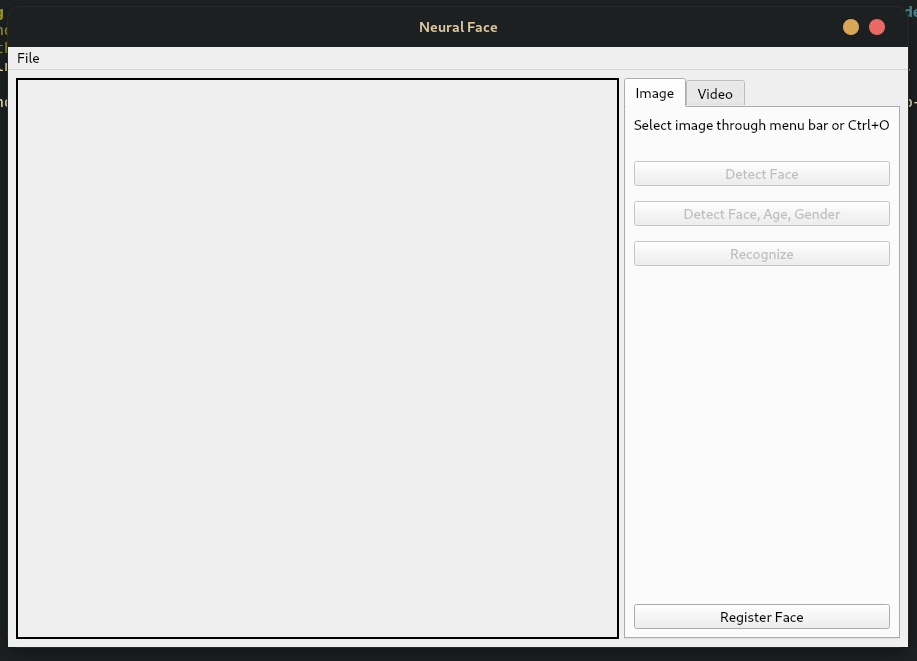
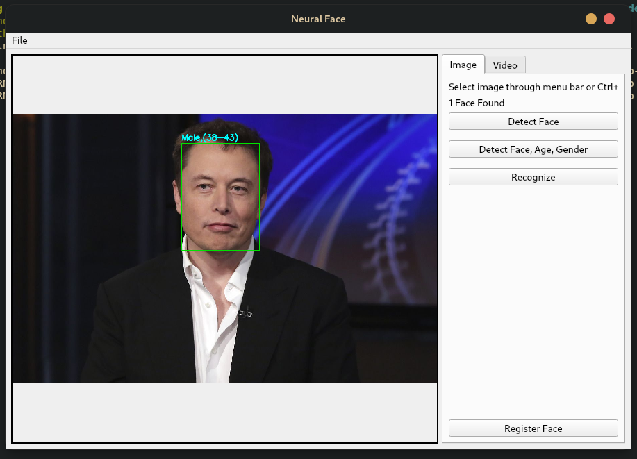

# neural_face


Should have opencv.

```
pip install torch facenet_pytorch opencv-python opencv-contrib-python retinaface-pytorch
python app.py --help
  
```

You need to have Qt5 base package for it to run
becuase PyQt5 and opencv conflict do below after installing above packages.
To run GUI:
```
  pip uninstall opencv-python opencv-contrib-python
  pip install opencv-python-headless opencv-contrib-python-headless PyQt5
  python gui.py
```


Database
create folder `saved` on same directory in format
```
  saved/ __
          \
          |- [name]/ - 
          |            pic1.jpg
          |            pic2.jpg
          |            ...
          |
          |- [name2]/ - 
          |             pic.jpg
          ....
```

To use webcam:
```
  python app.py --live -l recognize
  OR
  python app.py --live -l detect
```

To register image:
```
  python app.py --register -f /path/to/image
```

To Recognize/detect/attribute image:
```
  python app.py --recognize -f /path/to/image
  python app.py --detect -f /path/to/image
  python app.py --attribute -f /path/to/image
```


[](assets/demo.mp4)


| [](assets/ui.png) | [](assets/detected_face.png) |
| --- | --- | --- | --- |
| [](assets/gender_age.png) | [](assets/recognize_face.png) |

